# Beads Export

*Generated: Sat, 27 Dec 2025 16:31:01 PST*

## Summary

| Metric | Count |
|--------|-------|
| **Total** | 11 |
| Open | 11 |
| In Progress | 0 |
| Blocked | 0 |
| Closed | 0 |

## Quick Actions

Ready-to-run commands for bulk operations:

```bash
# Close open items (11 total, showing first 10)
bd close Slay-the-Saturn-53k Slay-the-Saturn-po5 Slay-the-Saturn-fgj Slay-the-Saturn-3ud Slay-the-Saturn-o1m Slay-the-Saturn-7yj Slay-the-Saturn-zka Slay-the-Saturn-bs5 Slay-the-Saturn-9fv Slay-the-Saturn-56k

# View high-priority items (P0/P1)
bd show Slay-the-Saturn-53k Slay-the-Saturn-po5 Slay-the-Saturn-fgj Slay-the-Saturn-3ud Slay-the-Saturn-o1m

```

## Table of Contents

- [🟢 Slay-the-Saturn-53k Web UI: Setup frontend framework with build tooling](#slay-the-saturn-53k)
- [🟢 Slay-the-Saturn-po5 Web UI: Implement WebSocket for real-time race updates](#slay-the-saturn-po5)
- [🟢 Slay-the-Saturn-fgj Web UI: Create REST API endpoints for race control](#slay-the-saturn-fgj)
- [🟢 Slay-the-Saturn-3ud Web UI: Setup FastAPI web framework with WebSocket support](#slay-the-saturn-3ud)
- [🟢 Slay-the-Saturn-o1m Add exception handling and stack traces to TUI error logging](#slay-the-saturn-o1m)
- [🟢 Slay-the-Saturn-7yj Web UI: Implement frontend state management](#slay-the-saturn-7yj)
- [🟢 Slay-the-Saturn-zka Web UI: Add CSV download functionality](#slay-the-saturn-zka)
- [🟢 Slay-the-Saturn-bs5 Web UI: Implement error log panel with toggle](#slay-the-saturn-bs5)
- [🟢 Slay-the-Saturn-9fv Web UI: Build race configuration form](#slay-the-saturn-9fv)
- [🟢 Slay-the-Saturn-56k Web UI: Build race dashboard component with live metrics](#slay-the-saturn-56k)
- [🟢 Slay-the-Saturn-z9z Web UI: Add documentation and update TESTING.md](#slay-the-saturn-z9z)

---

## Dependency Graph

```mermaid
graph TD
    classDef open fill:#50FA7B,stroke:#333,color:#000
    classDef inprogress fill:#8BE9FD,stroke:#333,color:#000
    classDef blocked fill:#FF5555,stroke:#333,color:#000
    classDef closed fill:#6272A4,stroke:#333,color:#fff

    Slay-the-Saturn-3ud["Slay-the-Saturn-3ud<br/>Web UI: Setup FastAPI web framework w..."]
    class Slay-the-Saturn-3ud open
    Slay-the-Saturn-53k["Slay-the-Saturn-53k<br/>Web UI: Setup frontend framework with..."]
    class Slay-the-Saturn-53k open
    Slay-the-Saturn-56k["Slay-the-Saturn-56k<br/>Web UI: Build race dashboard componen..."]
    class Slay-the-Saturn-56k open
    Slay-the-Saturn-7yj["Slay-the-Saturn-7yj<br/>Web UI: Implement frontend state mana..."]
    class Slay-the-Saturn-7yj open
    Slay-the-Saturn-9fv["Slay-the-Saturn-9fv<br/>Web UI: Build race configuration form"]
    class Slay-the-Saturn-9fv open
    Slay-the-Saturn-bs5["Slay-the-Saturn-bs5<br/>Web UI: Implement error log panel wit..."]
    class Slay-the-Saturn-bs5 open
    Slay-the-Saturn-fgj["Slay-the-Saturn-fgj<br/>Web UI: Create REST API endpoints for..."]
    class Slay-the-Saturn-fgj open
    Slay-the-Saturn-o1m["Slay-the-Saturn-o1m<br/>Add exception handling and stack trac..."]
    class Slay-the-Saturn-o1m open
    Slay-the-Saturn-po5["Slay-the-Saturn-po5<br/>Web UI: Implement WebSocket for real-..."]
    class Slay-the-Saturn-po5 open
    Slay-the-Saturn-z9z["Slay-the-Saturn-z9z<br/>Web UI: Add documentation and update ..."]
    class Slay-the-Saturn-z9z open
    Slay-the-Saturn-zka["Slay-the-Saturn-zka<br/>Web UI: Add CSV download functionality"]
    class Slay-the-Saturn-zka open

    NoLinks["No Dependencies"]
```



---

## 📋 Slay-the-Saturn-53k Web UI: Setup frontend framework with build tooling

| Property | Value |
|----------|-------|
| **Type** | 📋 task |
| **Priority** | ⚡ High (P1) |
| **Status** | 🟢 open |
| **Created** | 2025-12-27 16:24 |
| **Updated** | 2025-12-27 16:24 |

### Description

Initialize frontend project with modern JavaScript framework.

Framework Options (choose one):
- React + Vite (recommended for simplicity)
- Vue 3 + Vite
- Svelte + Vite

Requirements:
- Create evaluation/web/frontend/ directory
- Initialize project with npm/pnpm
- Configure build output to evaluation/web/static/
- Set up dev server with proxy to backend (http://localhost:8000)
- Install WebSocket client library (socket.io-client)
- Create basic App component with routing

Deliverables:
- evaluation/web/frontend/package.json
- evaluation/web/frontend/vite.config.js (or similar)
- evaluation/web/frontend/src/App.jsx
- npm run dev starts frontend dev server
- npm run build creates production bundle

Technical Notes:
- Frontend will connect to ws://localhost:8000 for WebSocket
- Use modern ES6+ JavaScript/TypeScript

<details>
<summary>📋 Commands</summary>

```bash
# Start working on this issue
bd update Slay-the-Saturn-53k -s in_progress

# Add a comment
bd comment Slay-the-Saturn-53k 'Your comment here'

# Change priority (0=Critical, 1=High, 2=Medium, 3=Low)
bd update Slay-the-Saturn-53k -p 1

# View full details
bd show Slay-the-Saturn-53k
```

</details>

---

## 📋 Slay-the-Saturn-po5 Web UI: Implement WebSocket for real-time race updates

| Property | Value |
|----------|-------|
| **Type** | 📋 task |
| **Priority** | ⚡ High (P1) |
| **Status** | 🟢 open |
| **Created** | 2025-12-27 16:24 |
| **Updated** | 2025-12-27 16:24 |

### Description

Set up WebSocket connection for streaming live simulation results to frontend.

WebSocket Events (Server to Client):
- race_started - Race initialization complete
- racer_update - Bot stats update after each simulation
- status_update - Global progress/ETA update
- error_logged - New error detected
- race_finished - All simulations complete

Event Payloads:
- racer_update: {bot_name, health, won, total_requests, invalid_responses, total_tokens, avg_response_time, invalid_rate}
- status_update: {completed_sims, total_sims, elapsed, eta, error_count}
- error_logged: {bot, simulation, error, time}

Technical Notes:
- Reference: evaluation/tui_main.py lines 345-399 (run_simulations worker)
- Replace self.call_from_thread() with socketio.emit()
- Maintain data_lock for thread-safe access
- Support multiple concurrent clients viewing same race

<details>
<summary>📋 Commands</summary>

```bash
# Start working on this issue
bd update Slay-the-Saturn-po5 -s in_progress

# Add a comment
bd comment Slay-the-Saturn-po5 'Your comment here'

# Change priority (0=Critical, 1=High, 2=Medium, 3=Low)
bd update Slay-the-Saturn-po5 -p 1

# View full details
bd show Slay-the-Saturn-po5
```

</details>

---

## 📋 Slay-the-Saturn-fgj Web UI: Create REST API endpoints for race control

| Property | Value |
|----------|-------|
| **Type** | 📋 task |
| **Priority** | ⚡ High (P1) |
| **Status** | 🟢 open |
| **Created** | 2025-12-27 16:23 |
| **Updated** | 2025-12-27 16:23 |

### Description

Implement core REST API endpoints for controlling race simulations.

Required Endpoints:
- POST /api/race/start - Start new race with config (bots, scenario, enemies, test_count, thread_count)
- GET /api/race/status - Get current race status
- POST /api/race/stop - Stop running race
- GET /api/race/results - Get race results
- GET /api/bots - List available bots
- GET /api/scenarios - List available scenarios

Request/Response Models:
- RaceConfig: {bot_names: list[str], scenario_index: int, enemies_str: str, test_count: int, thread_count: int}
- RaceStatus: {is_running: bool, completed_sims: int, total_sims: int, start_time: float}

Technical Notes:
- Reference: evaluation/tui_main.py lines 217-248 (RaceTUI.__init__)
- Reuse name_to_bot() from evaluate_bot.py
- Reuse get_scenario() logic for scenario loading

<details>
<summary>📋 Commands</summary>

```bash
# Start working on this issue
bd update Slay-the-Saturn-fgj -s in_progress

# Add a comment
bd comment Slay-the-Saturn-fgj 'Your comment here'

# Change priority (0=Critical, 1=High, 2=Medium, 3=Low)
bd update Slay-the-Saturn-fgj -p 1

# View full details
bd show Slay-the-Saturn-fgj
```

</details>

---

## 📋 Slay-the-Saturn-3ud Web UI: Setup FastAPI web framework with WebSocket support

| Property | Value |
|----------|-------|
| **Type** | 📋 task |
| **Priority** | ⚡ High (P1) |
| **Status** | 🟢 open |
| **Created** | 2025-12-27 16:23 |
| **Updated** | 2025-12-27 16:23 |

### Description

Select FastAPI and set up basic project structure with dependencies.

Requirements:
- Install FastAPI, uvicorn, python-socketio/websockets
- Create evaluation/web/ directory structure
- Create evaluation/web/server.py with basic FastAPI app
- Set up CORS configuration for localhost development
- Create /health endpoint for server status checks
- Create requirements-web.txt with web dependencies

Deliverables:
- evaluation/web/server.py - Main web server
- requirements-web.txt - Web dependencies  
- Server starts successfully with uvicorn server:app

Technical Notes:
- FastAPI preferred over Flask for async/WebSocket support
- Will need WebSocket for real-time race updates
- Reference: evaluation/tui_main.py lines 157-400 (RaceTUI class)

<details>
<summary>📋 Commands</summary>

```bash
# Start working on this issue
bd update Slay-the-Saturn-3ud -s in_progress

# Add a comment
bd comment Slay-the-Saturn-3ud 'Your comment here'

# Change priority (0=Critical, 1=High, 2=Medium, 3=Low)
bd update Slay-the-Saturn-3ud -p 1

# View full details
bd show Slay-the-Saturn-3ud
```

</details>

---

## 🐛 Slay-the-Saturn-o1m Add exception handling and stack traces to TUI error logging

| Property | Value |
|----------|-------|
| **Type** | 🐛 bug |
| **Priority** | ⚡ High (P1) |
| **Status** | 🟢 open |
| **Created** | 2025-12-27 16:06 |
| **Updated** | 2025-12-27 16:06 |
| **Labels** | bug, tui |

### Description

Currently TUI only logs 'Simulation crashed' for errors. Need to capture actual exceptions and stack traces from simulate_one() to help debug failures. Should wrap simulation calls in try-except and log full error details.

<details>
<summary>📋 Commands</summary>

```bash
# Start working on this issue
bd update Slay-the-Saturn-o1m -s in_progress

# Add a comment
bd comment Slay-the-Saturn-o1m 'Your comment here'

# Change priority (0=Critical, 1=High, 2=Medium, 3=Low)
bd update Slay-the-Saturn-o1m -p 1

# View full details
bd show Slay-the-Saturn-o1m
```

</details>

---

## 📋 Slay-the-Saturn-7yj Web UI: Implement frontend state management

| Property | Value |
|----------|-------|
| **Type** | 📋 task |
| **Priority** | 🔹 Medium (P2) |
| **Status** | 🟢 open |
| **Created** | 2025-12-27 16:25 |
| **Updated** | 2025-12-27 16:25 |

### Description

Set up state management for race data and real-time updates.

State Structure:
- raceConfig: {bot_names, scenario_index, enemies_str, test_count, thread_count}
- raceStatus: {is_running, is_finished, completed_sims, total_sims, start_time, error_count}
- racerData: Map<bot_name, {wins, losses, errors, avg_health, sims_complete, total_requests, total_tokens, ...}>
- errorLog: Array<{bot, simulation, error, time}>

State Management Options:
- React: Zustand or Context API + useReducer
- Vue: Pinia or Vuex
- Svelte: Writable stores

WebSocket Integration:
- Connect on component mount
- Subscribe to events: racer_update, status_update, error_logged, race_finished
- Update state on each event
- Disconnect on unmount
- Reconnection logic with exponential backoff

Persistence:
- Save last race config to localStorage
- Option to resume viewing completed race
- Clear state on new race start

Technical Notes:
- Reference: evaluation/tui_main.py lines 217-248 (RaceTUI state)
- Immutable updates for React/Vue reactivity
- Debounce rapid updates if needed (>10/sec)

<details>
<summary>📋 Commands</summary>

```bash
# Start working on this issue
bd update Slay-the-Saturn-7yj -s in_progress

# Add a comment
bd comment Slay-the-Saturn-7yj 'Your comment here'

# Change priority (0=Critical, 1=High, 2=Medium, 3=Low)
bd update Slay-the-Saturn-7yj -p 1

# View full details
bd show Slay-the-Saturn-7yj
```

</details>

---

## 📋 Slay-the-Saturn-zka Web UI: Add CSV download functionality

| Property | Value |
|----------|-------|
| **Type** | 📋 task |
| **Priority** | 🔹 Medium (P2) |
| **Status** | 🟢 open |
| **Created** | 2025-12-27 16:25 |
| **Updated** | 2025-12-27 16:25 |

### Description

Allow users to download results.csv and errors.csv from browser.

Download Features:
- Save Results button (enabled when race has data)
- Downloads results.csv with columns:
  - BotName, PlayerHealth, Win, TotalRequests, InvalidResponses, TotalTokens, AvgResponseTime, InvalidRate
- Downloads errors.csv if errors exist
- Automatic filename with timestamp
- Show download success notification

Backend Endpoint:
- GET /api/race/download/results - Returns CSV file
- GET /api/race/download/errors - Returns errors CSV
- Content-Type: text/csv
- Content-Disposition: attachment; filename=results_{timestamp}.csv

UI:
- Button in header/status bar
- Dropdown: Download Results, Download Errors, Download Both (ZIP)
- Disable while race not started
- Show file size before download

Technical Notes:
- Reference: evaluation/tui_main.py lines 314-343 (action_save_results)
- Use Blob API for client-side CSV generation (alternative)
- Consider streaming large result sets
- Match exact CSV format for compatibility with plot_evaluation.py

<details>
<summary>📋 Commands</summary>

```bash
# Start working on this issue
bd update Slay-the-Saturn-zka -s in_progress

# Add a comment
bd comment Slay-the-Saturn-zka 'Your comment here'

# Change priority (0=Critical, 1=High, 2=Medium, 3=Low)
bd update Slay-the-Saturn-zka -p 1

# View full details
bd show Slay-the-Saturn-zka
```

</details>

---

## 📋 Slay-the-Saturn-bs5 Web UI: Implement error log panel with toggle

| Property | Value |
|----------|-------|
| **Type** | 📋 task |
| **Priority** | 🔹 Medium (P2) |
| **Status** | 🟢 open |
| **Created** | 2025-12-27 16:25 |
| **Updated** | 2025-12-27 16:25 |

### Description

Create toggleable error panel matching TUI functionality.

Features:
- Collapsible panel at bottom of dashboard (initially hidden)
- Toggle button (similar to TUI e key)
- Display error entries with timestamp, bot name, simulation number, error message
- Color-coded by severity (red for crashes, yellow for warnings)
- Auto-scroll to latest error
- Clear button to reset error log
- Show error count badge on toggle button

Error Entry Format:
- [HH:MM:SS] Error in {bot_name} sim #{sim_num}: {error_message}
- Group by bot name option
- Filter by error type

UI Design:
- Max height: 300px with scroll
- Monospace font for error messages
- Copy button for each error
- Export errors to CSV button

Technical Notes:
- Reference: evaluation/tui_main.py lines 298-306 (log_error method)
- Listen for error_logged WebSocket events
- Store errors in component state
- Panel initially hidden, same as TUI (show_errors=false)

<details>
<summary>📋 Commands</summary>

```bash
# Start working on this issue
bd update Slay-the-Saturn-bs5 -s in_progress

# Add a comment
bd comment Slay-the-Saturn-bs5 'Your comment here'

# Change priority (0=Critical, 1=High, 2=Medium, 3=Low)
bd update Slay-the-Saturn-bs5 -p 1

# View full details
bd show Slay-the-Saturn-bs5
```

</details>

---

## 📋 Slay-the-Saturn-9fv Web UI: Build race configuration form

| Property | Value |
|----------|-------|
| **Type** | 📋 task |
| **Priority** | 🔹 Medium (P2) |
| **Status** | 🟢 open |
| **Created** | 2025-12-27 16:25 |
| **Updated** | 2025-12-27 16:25 |

### Description

Create form for configuring and starting race simulations.

Form Fields:
- Bot Selection (multi-select dropdown, fetched from /api/bots)
- Scenario (dropdown, fetched from /api/scenarios)
- Enemies (text input with validation, e.g. h, ghl, j)
- Test Count (number input, default: 25)
- Thread Count (number input, default: 4, max: CPU count)
- Custom Save Directory (text input, optional)

Validation:
- At least 1 bot selected
- Valid scenario index (0-5)
- Valid enemy string (only h/g/l/j characters)
- Test count > 0, < 1000
- Thread count 1-16

UI Features:
- Preset configs (e.g. Quick Test, Premium Agents, GIGL Random)
- Bot descriptions on hover
- Scenario preview (shows starting deck)
- Estimated time calculation (based on bot type)
- Disable form while race running

Technical Notes:
- Reference: evaluation/tui_main.py main() argument parsing
- Reference: TESTING.md for common test configurations
- Submit to POST /api/race/start endpoint

<details>
<summary>📋 Commands</summary>

```bash
# Start working on this issue
bd update Slay-the-Saturn-9fv -s in_progress

# Add a comment
bd comment Slay-the-Saturn-9fv 'Your comment here'

# Change priority (0=Critical, 1=High, 2=Medium, 3=Low)
bd update Slay-the-Saturn-9fv -p 1

# View full details
bd show Slay-the-Saturn-9fv
```

</details>

---

## 📋 Slay-the-Saturn-56k Web UI: Build race dashboard component with live metrics

| Property | Value |
|----------|-------|
| **Type** | 📋 task |
| **Priority** | 🔹 Medium (P2) |
| **Status** | 🟢 open |
| **Created** | 2025-12-27 16:24 |
| **Updated** | 2025-12-27 16:24 |

### Description

Create main race view showing bot progress bars and real-time metrics.

Components to Build:
- RaceDashboard (main container)
- RacerCard (per-bot display, replaces RacerWidget)
- ProgressBar (simulation progress, 0-100%)
- WinBar (win rate visualization)
- StatusBar (global progress, ETA, elapsed time)

RacerCard Display (per bot):
- Bot name + average health
- Simulation progress bar (replaces TUI characters with HTML progress bar)
- Win progress bar (filled bar with gradient)
- Stats: W/L ratio, total tokens, avg response time
- Error count (red badge if > 0)
- Current activity message

UI Features:
- Auto-scroll to bottom as race progresses
- Color coding: green (wins), red (errors), yellow (invalid responses)
- Responsive layout for mobile/tablet
- Dark mode support

Technical Notes:
- Reference: evaluation/tui_main.py lines 29-118 (RacerWidget)
- Update every ~100ms when race running
- Use CSS animations for smooth progress bar fills

<details>
<summary>📋 Commands</summary>

```bash
# Start working on this issue
bd update Slay-the-Saturn-56k -s in_progress

# Add a comment
bd comment Slay-the-Saturn-56k 'Your comment here'

# Change priority (0=Critical, 1=High, 2=Medium, 3=Low)
bd update Slay-the-Saturn-56k -p 1

# View full details
bd show Slay-the-Saturn-56k
```

</details>

---

## 📋 Slay-the-Saturn-z9z Web UI: Add documentation and update TESTING.md

| Property | Value |
|----------|-------|
| **Type** | 📋 task |
| **Priority** | ☕ Low (P3) |
| **Status** | 🟢 open |
| **Created** | 2025-12-27 16:26 |
| **Updated** | 2025-12-27 16:26 |

### Description

Document web UI usage and add to testing guide.

Documentation Tasks:
1. Create evaluation/web/README.md
   - Installation instructions (pip install -r requirements-web.txt, npm install)
   - Running dev server (backend + frontend)
   - Production deployment
   - Architecture overview
   - API documentation

2. Update TESTING.md
   - Add new section: Web UI Evaluation
   - Usage examples:
     - Start server: python evaluation/web/server.py
     - Access UI: http://localhost:8000
     - Configuration options
   - Screenshots/GIFs of web UI
   - Comparison with TUI (when to use each)

3. Update CLAUDE.md
   - Add web UI to architecture section
   - Document FastAPI integration
   - WebSocket communication patterns

4. Create DEVELOPMENT.md (optional)
   - Frontend development setup
   - Adding new bot types to UI
   - Customizing dashboard
   - Troubleshooting common issues

Screenshots Needed:
- Configuration form
- Race in progress
- Completed race with results
- Error panel expanded

Technical Notes:
- Include API endpoint documentation (OpenAPI/Swagger)
- Document environment variables if any
- Add web UI to main README.md

<details>
<summary>📋 Commands</summary>

```bash
# Start working on this issue
bd update Slay-the-Saturn-z9z -s in_progress

# Add a comment
bd comment Slay-the-Saturn-z9z 'Your comment here'

# Change priority (0=Critical, 1=High, 2=Medium, 3=Low)
bd update Slay-the-Saturn-z9z -p 1

# View full details
bd show Slay-the-Saturn-z9z
```

</details>

---

